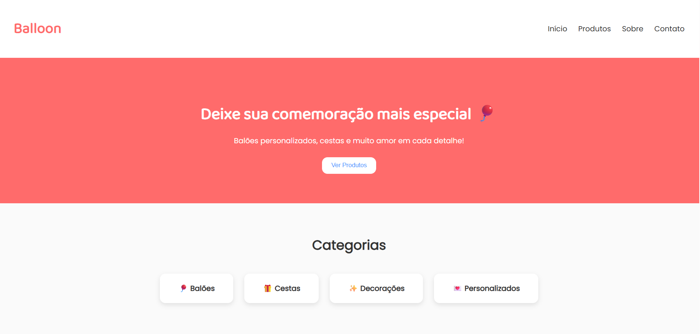
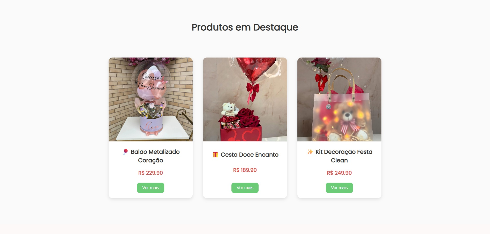
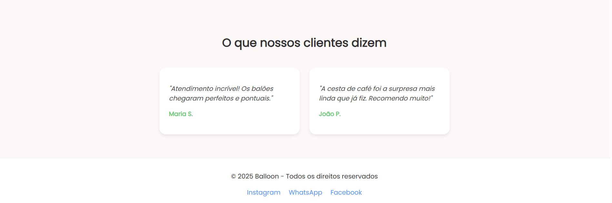

# Loja Balloone 🎈

Projeto real desenvolvido para atender a uma necessidade de uma pequena empreendedora, com o objetivo de melhorar o atendimento ao cliente e centralizar as informações da loja em um só lugar.

## 🚩 Problema

A loja enfrentava um alto volume de mensagens repetitivas nas redes sociais. Muitos clientes faziam as mesmas perguntas: como funcionam os pedidos? Quais são os produtos disponíveis? Qual o valor mínimo de entrega?

Esse fluxo descentralizado gerava perda de tempo e deixava os atendimentos mais lentos e propensos a erros.

## ✅ Solução

Criação de um site simples, objetivo e funcional para:

- Apresentar os produtos disponíveis com imagens, preços e descrições
- Explicar as regras de funcionamento da loja (formas de pedido, entrega, etc.)
- Incluir formulários para contato
- Reduzir o número de mensagens repetitivas via WhatsApp/Instagram

## 🧠 Tecnologias Utilizadas

- **Django** (Python) — back-end
- **HTML, CSS e Python**
- Versionamento com **Git + GitHub**

## 💡 Aprendizados

- Aplicação prática de conceitos de back-end com Django
- Integração de HTML com lógica do Python
- Estruturação de rotas, views e templates
- Organização de projeto para resolver um problema real de negócio

## 📸 Demonstração página Home





## 📌 Status do Projeto

🟡 Em desenvolvimento  
🟡 Página inicial (em desenvolvimento) 
🟡 Exibição de produtos (em desenvolvimento)
🔜 Integração com API de pagamento  
🔜 Área administrativa restrita

## 📁 Como rodar localmente

```bash
git clone https://github.com/seu-usuario/loja-balloone.git
cd loja-balloone
python manage.py runserver
